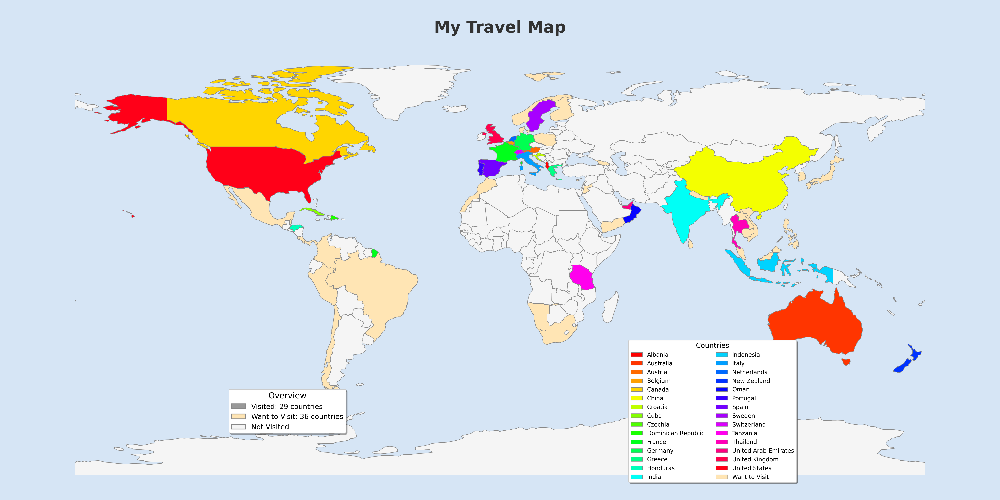

# country-counter

A toolkit for analyzing and visualizing visited countries from Google Takeout saved places data. The project processes Google Maps exports, geocodes locations to determine countries and states, and generates customizable world maps showing your travels.



## Prerequisites

1. **Google Maps API Key**: You need a Google Maps API key with the Geocoding API enabled.
   - Go to [Google Cloud Console](https://console.cloud.google.com/)
   - Create a new project or select an existing one
   - Enable the "Geocoding API"
   - Create credentials (API key)
   - Copy the API key

2. **CSV Export**: Export your places from Google Takeout
   - Go to [Google Takeout](https://takeout.google.com/)
   - Select "Maps (your places)"
   - Export and download the data
   - Extract the `Visited.csv` file to the same directory as this script

## Usage

### Quick Start: Generate All Maps (Automated)

The easiest way to process your Google Takeout data and generate all map variations is to use `generate_maps.py`:

```bash
# Process a single Google Takeout CSV file and generate all map variants
uv run scripts/generate_maps.py takeout/Visited.csv

# Include a secondary dataset (e.g., "want to visit" countries)
uv run scripts/generate_maps.py takeout/Visited.csv \
  --secondary-file takeout/Planned.csv \
```

This automated script will:
1. Run `count_countries.py` to geocode the CSV and generate a JSON file
2. Generate 4 map variations:
   - Countries and states with legend or labels
   - Countries with legend or labels (no state detail)

All generated maps are saved to the `build/` directory.

### Manual Workflow

#### Step 1: Count Countries (Geocoding)

Process your Google Takeout CSV file to count countries and states:

```bash
# Set up your Google Maps API key first
echo "GOOGLE_MAPS_API_KEY=<your_api_key>" > .env

# Process the CSV file
uv run scripts/count_countries.py takeout/Visited.csv
```

This generates a JSON file in `build/` containing country data with states and location coordinates.

#### Step 2: Plot Countries on a Map

Use the JSON output from `count_countries.py` to generate a world map visualization:

```bash
# Basic map with state-level detail
uv run scripts/plot_countries.py build/Visited_countries.json

# Include a secondary dataset (e.g., "Planned" countries)
uv run scripts/plot_countries.py build/Visited_countries.json \
  --secondary-file build/Planned_countries.json

# Generate a map with entire country colored and labels instead of legend
uv run scripts/plot_countries.py build/Visited_countries.json \
  --color-full-country --show-labels
```

Secondary countries are displayed in a distinct uniform color to differentiate them from visited locations, which each use a unique color.

## Features

- **Caching**: Caches geocoding results to avoid redundant API calls and reduce costs
- **Progress tracking**: Shows real-time progress as it processes locations
- **Interruptible**: You can interrupt (Ctrl+C) and resume later - progress is saved

## Output Example

```
Total unique countries: 29
Total unique states across all countries: 100

Countries (with location counts and states):
  • Albania: 28 locations
  • Australia: 97 locations
    - New South Wales
    - Queensland
    - Victoria
  ...

⚠️  Failed to lookup 39 location(s)
These may need manual review. See cache/<takeout_name>_failed_lookups.json for details.
```

Note that the total number of states is only accurate with the generated maps because this uses spatial containment, whereas geocoding may not return a result.

### Generated files:

- `build/<takeout_name>_countries.json` - Structured data with geocoded countries, states, and coordinates
- `cache/<takeout_name>_place_names.json` - Cached geocoding results for place names
- `cache/shared_hex_coord_cache.json` - Shared cache for coordinates (reused across Takeout files)
- `cache/<takeout_name>_failed_lookups.json` - Locations that couldn't be geocoded

## Cost Considerations

The Google Maps Geocoding API has a cost associated with it:
- First $200/month is free (includes ~40,000 requests)
- After that, it's $5 per 1000 requests

With caching enabled, you'll only pay for new locations on subsequent runs.
